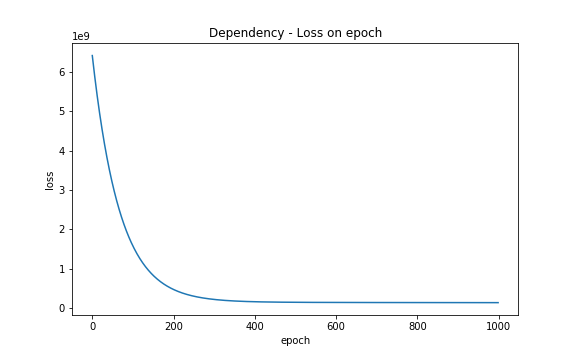

<h1>1.Simple Linear Regression</h1>

As a first subproject I've implemented SimpleLinearRegression class. This model enables to fit the input data
 (that is 1-Dimensional vector/tensor) to a continous set of labels.

In this particular example each point represents a single human - worker, X-axis his position at work, Y- axis his salary. The model tries to predict how much people should earn.

The data comes from UDEMY ML Course [A-Z]

</img>
</img>

On the left there is a plot representing how the model changes in time(when the epochs are growing). The final epoch is equal to 100k.

On the right we can see a graph displaying the dependency of loss on the epoch(in range 0-1000). After 1000 epoch the change is really very small.
