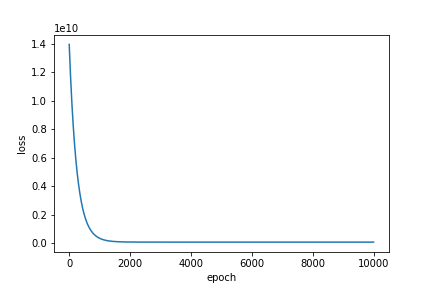
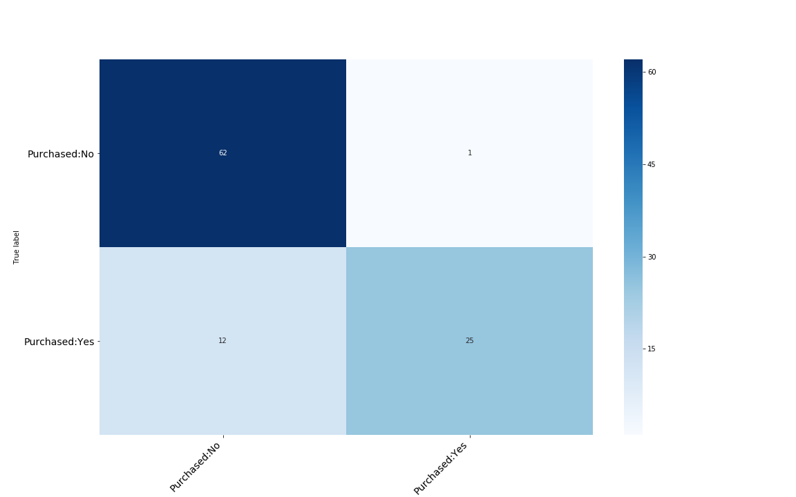
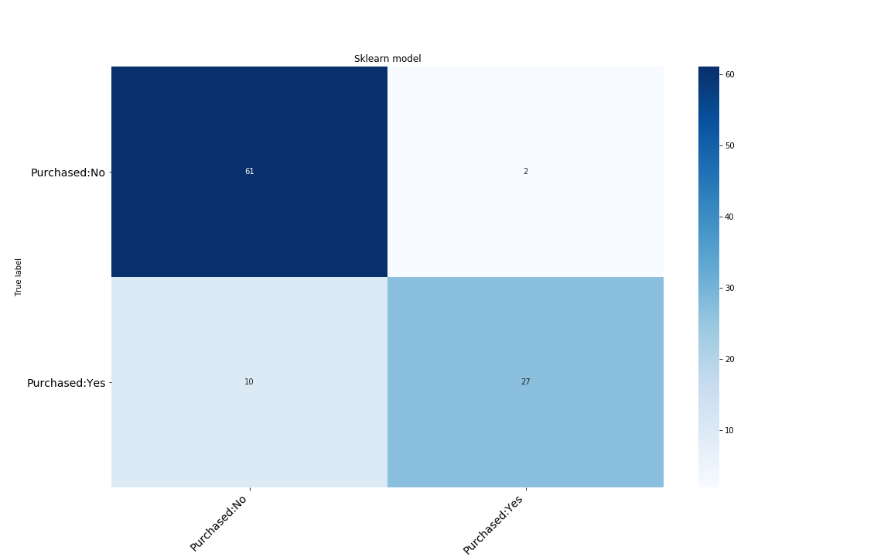

<h1>0.Introduction</h1>
Below there is a list of projects I've prepared for this repository.
<ul>
	<li><a href = "https://github.com/lukasy09/Machine-Learning-From-Scratch/tree/master/SimpleLinearRegression">Simple Linear Regression</a></li>
	<li><a href = "https://github.com/lukasy09/Machine-Learning-From-Scratch/tree/master/MultipleLinearRegression">Multiple Linear Regression</a></li>
</ul>

<h1 id ="SLR">1.Simple Linear Regression</h1>

As a first subproject I've implemented SimpleLinearRegression class. This model enables to fit the input data
 (that is 1-Dimensional vector/tensor) to a continous set of labels.

In this particular example each point represents a single human - worker, X-axis his position at work, Y- axis his salary. The model tries to predict how much people should earn.

The data comes from UDEMY ML Course [A-Z]

</img>

</img>

On the first picture/gif there is a plot representing how the model changes in time(when the epochs are growing). The final epoch is equal to 100k.

On the second one we can see a graph displaying the dependency of loss on the epoch(in range 0-1000). After 10000th epoch the change is really very small and is comparable with sklearn model.

<h1 id ="MLR">2. Multiple Linear Regression</h1>

More general version of the previous class. This time regression object takes a matrix of data as input. We can use regression for more compound problems

Note: After about ~5000 epochs the model in most cases is almost as good as the Sklearn's LineaRegression

</img>

<h1 id ="LR">3.Logistic Regression</h1>

In this project I've implemented (binary) Logistic Regression learning model. 

In this particular example the model tries to make a difference between people who purchased some goods or didn't.

As independent variables we have got: Man's age, estimated salary and sex.

The Dataset comes from the Udemy ML course and that's just an example of the working model

Below there are 2 confusion matrixes, the first one  represents my model for the particular test data, the second one 
belongs to sklearn model for the same test data.

</img>

</img>

